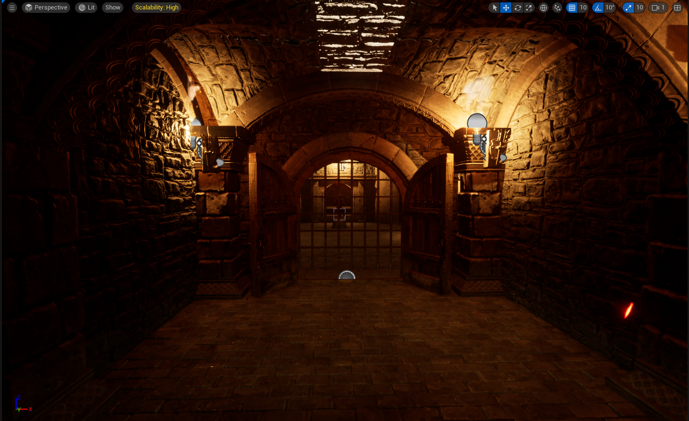
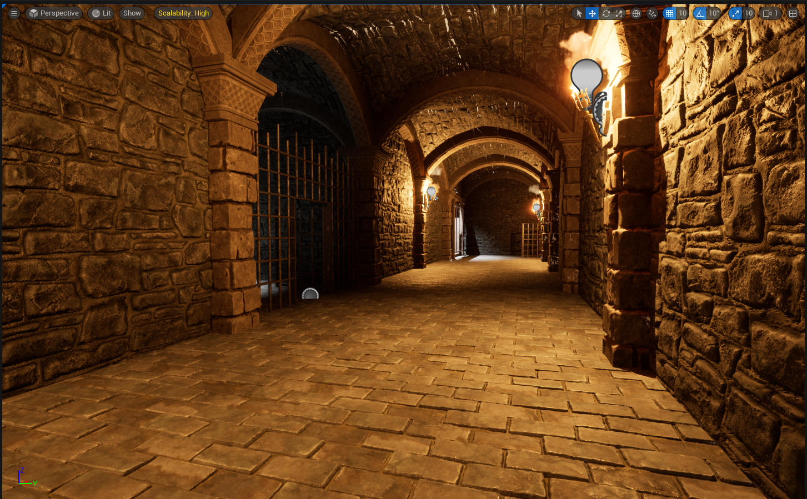

# Crypt Raider - Unreal Engine 5

This project is a game level developed in **Unreal Engine 5** to showcase my skills in advanced game development concepts. It is not intended for commercial use but serves as a demonstration of my abilities in designing complex game environments and implementing high-level functionalities.

## About the Project

- Utilized high-quality **MedivalDungeon** asset (publicaly availale) to create an immersive and visually stunning environment.
- Implemented advanced lighting techniques using **Lumen Lighting** to enhance realism and atmosphere.
- Learned and applied complex concepts including:
  - **Scene Components** and **Actor Components** for modular and reusable game design.
  - **Physics interactions** for realistic object behavior and environment dynamics.
  - **World pointers and references** for efficient object management and communication.
  - **Pointers in C++** to handle memory management and optimize performance.
  - **Blueprint Callable Functions** to bridge C++ and Blueprint, enabling dynamic gameplay mechanics.
  - **Collision and Interaction Concepts** to manage interactions between multiple objects, ensuring logical and consistent behavior within the game world.
- Gained experience in implementing **core functionalities** and creating a cohesive, engaging gameplay experience.

## Purpose

This project is solely intended to demonstrate my proficiency with **Unreal Engine 5**, including advanced programming and design concepts. It is meant to showcase my capability to create complex and visually appealing game environments.

## Screenshots

  

---

This project is for personal showcase purposes only and is not intended for public use or distribution. If you have any questions or feedback, feel free to reach out!
